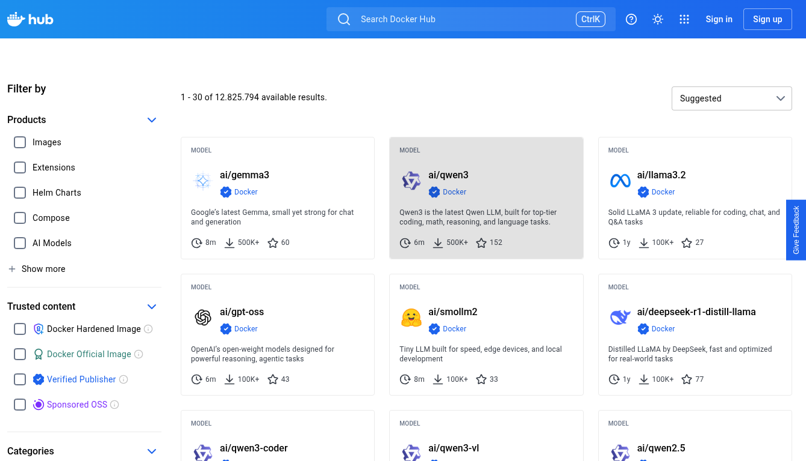
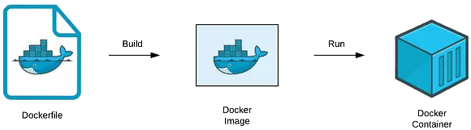

# Docker para Iniciantes
Embale seu código e leve para qualquer lugar


---

## :whale: Acesso ao material

- GitHub Pages:
[erlonpr.github.io/slides-docker](https://erlonpr.github.io/slides-docker/)
- GitHub Repository:
[github.com/erlonpr/slides-docker](https://github.com/erlonpr/slides-docker)

---

## :whale: Sobre mim

Analista de sistemas e programador freelancer

- GitHub: [github.com/erlonpr](https://github.com/erlonpr)
- LinkedIn: [linkedin.com/in/erlonpr](https://linkedin.com/in/erlonpr)
- Blog: [erlonpr.github.io/blog](https://erlonpr.github.io/blog)


---

## :whale: Conhecimentos necessários

- Linux
- Redes
- Lógica de programação


---

## :whale: Contextualizando o problema

> "Na minha máquina funciona!"

Programador | **Devops** | Infraestrutura


---

## :whale: O que é o Docker?

Ferramenta de automação baseada em contêineres que facilita o desenvolvimento, testes e deployment de aplicações.


---

## :whale: Virtualização vs. Contêinerização

| Máquina Virtual (VM) | Contêiner (Docker) |
| :--- | :--- |
| Emula o hardware e possui um SO completo | Compartilha o Kernel do SO hospedeiro |
| Pesado (Gigas de tamanho) | Leve (Megabytes) |
| Velocidade de inicialização lenta | Velocidade de inicialização rápida |
| Isolamento de SO | Isolamento de processos   |

> Namespaces: Isolam os processos
> Cgroups: Controlam o uso de recursos

---

## :whale: Arquitetura do Docker

- Docker
```
[Hardware] -> [Kernel SO Host] -> [Docker Daemon] -> [Contêineres] -> [Aplicação]
```

- Virtualização
```
[Hardware] -> [Kernel SO Host] -> [Hypervisor Hosted] -> [SO Convidado] -> [Aplicação]
```

> *Hypervisor: software que cria e executa máquinas virtuais*
> *- Tipo 1 (Bare-metal): Xen, Hyper-V, Proxmox*
> *- Tipo 2 (Hosted): VMWare, VirtualBox*

---

## :whale: Instalação do Docker no Linux

```bash
# Comando para instalar o Docker no Linux
curl -fsSL https://get.docker.com -o get-docker.sh && sudo sh get-docker.sh

# Comandos para adicionar o usuário atual ao grupo docker
sudo usermod -aG docker $USER
newgrp docker # ativa o grupo docker sem reiniciar o computador

# Comando para ativar o daemon do Docker
sudo systemctl enable docker
sudo systemctl start docker

# Comando para testar a instalação do Docker
docker -v
```
---

## :whale: Instalação do Docker no Windows

> Requisitos: WSL 2 e ativar a virtualização na BIOS/UEFI

```powershell
# Comando para instalar o WSL:
wsl --install

# Caso esteja instalado o WSL 1, é preciso atualizá-lo com o comando:
wsl --update

# Comando para definir o WSL 2 como padrão
wsl --set-default-version 2

# É necessário reiniciar o computador para que o WSL 2 seja ativado através do comando:
shutdown /r /t 0

# Comando para instalar o Docker no Windows
winget install Docker.DockerDesktop
# É necessário abrir o Docker Desktop e aguardar a inicialização do daemon

# Comando para testar a instalação do Docker
docker -v
```

---

## :whale: Componentes do Docker

- **Daemon**: Processo em segundo plano responsável por gerenciar os contêineres
- **Cliente**: Interface de linha de comando (CLI)
- **Registries**: Repositórios de imagens (Docker Hub, GHCR)

---

## :whale: DockerHub

Registro público de imagens Docker

Fonte: [hub.docker.com/search](https://hub.docker.com/search)

---

## :whale: Conceitos fundamentais

- **Imagem**: Template para criar contêineres
- **Contêiner**: Instância de uma imagem
- **Volume**: Armazenamento persistente
- **Rede**: Comunicação entre contêineres
- **Variáveis de ambiente**: Configurações dos contêineres

---

## :whale: O que é uma imagem?

- É um pacote estático, somente leitura (read-only).
- Contém tudo o que a aplicação precisa para rodar:
  - código
  - runtime
  - bibliotecas
  - variáveis de ambiente
- Funciona como um **molde** ou **receita de bolo**
- A partir de uma imagem, cria-se vários **contêineres**

---

## :whale: Dockerfile

Arquivo YAML com as instruções para montar uma imagem

```dockerfile
# Define a imagem base obtida no Docker Hub
FROM node:18-alpine

# Define o diretório de trabalho dentro do contêiner
WORKDIR /app

# Copia os arquivos da sua máquina para o contêiner
COPY package.json index.js ./

# Instala as dependências
RUN npm install

# Comando que o contêiner vai rodar ao iniciar
CMD ["node", "index.js"]
```

---

## :whale: Fluxo de construção de imagens



Fonte: [medium.com/swlh/understand-dockerfile-dd11746ed183](https://medium.com/swlh/understand-dockerfile-dd11746ed183)

---

## :whale: Comandos básicos de imagens

```bash
# Lista todas as imagens
docker images

# Puxa uma imagem do Docker Hub
docker pull ubuntu:22.04

# Remove uma imagem
docker rmi ubuntu:22.04

# Constrói uma imagem a partir de um Dockerfile
docker build -t meu-app .
```

---

## :whale: O que é um contêiner?

- É a **imagem em execução** (instância da "receita").
- Um processo isolado do resto do sistema operacional, com sua própria rede e arquivos.
- **Efêmero:** Por padrão, qualquer dado salvo dentro dele é perdido quando o contêiner é destruído (por isso usamos volumes).
- Pode ser iniciado, pausado ou destruído rapidamente.

---

## :whale: Comandos básicos de contêineres

```bash
# Comando para listar os contêineres em execução:
docker ps

# Comando para listar os contêineres em execução e parados:
docker ps -a

# Comando para criar e rodar um novo contêiner em segundo plano:
docker run -d --name meu-site nginx

# Comando para parar um contêiner existente:
docker stop meu-site

# Comando para reiniciar um contêiner existe:
docker start meu-site

# Comando para remover um contêiner (ele precisa estar parado):
docker rm meu-site
```
---

## :whale: Como ver os logs do container

```bash
# Comando para ver o histórico completo de log:
docker logs meu-site

# Comando para acompanhar os logs em tempo real (debug):
docker logs -f meu-site

# Comando para ver apenas as últimas 50 linhas:
docker logs --tail 50 meu-site
```

---

## :whale: O que é um volume?

- Contêineres são voláteis 
- Volumes funcionam como uma unidade de armazenamento conectado ao contêiner.
- Os dados sobrevivem intactos mesmo se o contêiner for destruído, atualizado ou recriado.
---

## :whale: Tipos de armazenamento
Existem duas formas principais de persistir dados no Docker:

| Tipo | Local de salvamento | Quando usar |
| :--- | :--- | :--- |
| **Named Volumes** | Gerenciado pelo próprio Docker | Bancos de dados (Postgres, MySQL) e uso em produção. |
| **Bind Mounts** | Pasta específica da máquina | Desenvolvimento (*Hot Reload*) |

---

## :whale: Comandos básicos de volumes

```bash
# Comando para criar um volume:
docker volume create dados-do-banco

# Comando para listar todos os volumes:
docker volume ls

# Comando para verificar onde o volume está salvo fisicamente:
docker volume inspect dados-do-banco

# Comando para apagar um volume específico:
docker volume rm dados-do-banco

# Comando para apagar todos os volumes que não estão sendo usados:
docker volume prune
```

---

## :whale: O que são redes Docker?

- Contêineres nascem totalmente isolados.
- As redes permitem que contêineres falem entre si, com a máquina host ou com a internet de forma segura.
- O Docker utiliza um DNS interno para que um contêiner acha o outro apenas pelo *nome* (não precisa descobrir o IP)

---

## :whale: Tipos de redes

| Tipo | Como funciona? | Quando usar? |
| :--- | :--- | :--- |
| **Bridge** | Rede virtual interna (VPN padrão) com port mapping | Comunicação entre contêineres no mesmo PC por meio de IP internos |
| **Host** | O contêiner usa a mesma rede da máquina (Remove o isolamento) | Quando precisa de máxima performance e não quer mapear portas |
| **None** | Desabilita totalmente a rede (somente interface loopback) | Scripts isolados de segurança máxima |
| **Overlay** | Conecta contêineres em servidores diferentes por meio de um túnel VXLAN | Ambientes complexos / Clusterização (Docker Swarm) |

---

## :whale: Comandos básicos de redes

```bash
# Comando para listar todas as redes:
docker network ls

# Comando para criar uma rede:
docker network create rede-da-faculdade

# Comando para visualizar detalhes de uma rede (mostra o IP de cada contêiner nela):
docker network inspect rede-da-faculdade

# Comando para conectar um contêiner que já está rodando a uma rede:
docker network connect rede-da-faculdade meu-site

# Comando para remover uma rede:
docker network rm rede-da-faculdade
```

---

## :whale: O que são variáveis de ambiente?

- São valores dinâmicos passados para o contêiner no momento em que ele é iniciado
- Não se deve "chumbar" (hardcode) senhas, tokens de API ou IPs dentro do código ou da imagem Docker
- Criar imagem genérica e use variáveis para mudar o seu comportamento

---

## :whale: Como definir variáveis de ambiente

- Flag `-e` no comando `docker run`
`docker run -e POSTGRES_PASSWORD=senha_secreta postgres`

- Docker Compose
```yaml
services:
  api:
    image: node:18-alpine
    environment:
      - NODE_ENV=development
      - PORT=3000
```
- Arquivo `.env` mantém dados sensíveis fora do código-fonte
`PORT=3000`

---