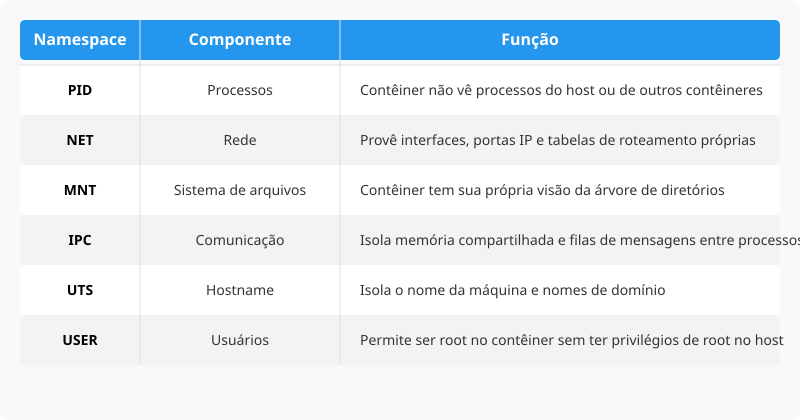

# Docker para Iniciantes
Embale seu código e leve para qualquer lugar

---

## :whale: Acesso ao material

- GitHub Pages:
[erlonpr.github.io/slides-docker](https://erlonpr.github.io/slides-docker/)
- GitHub Repository:
[github.com/erlonpr/slides-docker](https://github.com/erlonpr/slides-docker)

---

## :whale: Sobre mim

Analista de sistemas e programador freelancer

- GitHub: [github.com/erlonpr](https://github.com/erlonpr)
- LinkedIn: [linkedin.com/in/erlonpr](https://linkedin.com/in/erlonpr)
- Blog: [erlonpr.github.io/blog](https://erlonpr.github.io/blog)


---

## :whale: Conhecimentos necessários

- Linux
- Redes
- Lógica de programação


---

## :whale: Contextualizando o problema

> "Na minha máquina funciona!"

Programador | **Devops** | Infraestrutura


---

## :whale: O que é o Docker?

Ferramenta de automação baseada em contêineres que facilita o desenvolvimento, testes e deployment de aplicações.


---

## :whale: Precursor do Docker

- **Linux LXC**: permite isolar ambientes utilizando componentes do Kernel do Linux:

  - **Cgroups (Control Groups)**: Controlam o uso de recursos de hardware (memória RAM, CPU)

  - **Namespaces**: Cria uma camada de invisibilidade (isola o que o processo pode "enxergar" no sistema)

---

## :whale: Namespaces



---

## :whale: Criação do Docker

- Docker até a versão 0.8 era um *wrapper* para o Linux LXC (dependia da biblioteca `lxc-tools`)

- Criação da biblioteca **libcontainer** em 2014 para manipulação de contêineres (portabilidade entre distribuições)

> Biblioteca libcontainer foi doada à Open Container Initiative (OCI) e incorporada à `runc` (biblioteca de execução de containers utilizada pelo Kubernetes)

---

## :whale: Virtualização vs. Contêinerização

| Máquina Virtual (VM) | Contêiner (Docker) |
| :--- | :--- |
| Emula o hardware e possui um SO completo | Compartilha o Kernel do SO hospedeiro |
| Pesado (Gigas de tamanho) | Leve (Megabytes) |
| Velocidade de inicialização lenta | Velocidade de inicialização rápida |
| Isolamento de SO | Isolamento de processos   |

---

## :whale: Arquitetura do Docker

- Docker
```
[Hardware] -> [Kernel SO Host] -> [Docker Daemon] -> [Contêineres] -> [Aplicação]
```

- Virtualização
```
[Hardware] -> [Kernel SO Host] -> [Hypervisor Hosted] -> [SO Convidado] -> [Aplicação]
```

> *Hypervisor: software que cria e executa máquinas virtuais*
> *- Tipo 1 (Bare-metal): Xen, Hyper-V, Proxmox*
> *- Tipo 2 (Hosted): VMWare, VirtualBox*

---

## :whale: Instalação do Docker no Linux

```bash
# Comando para instalar o Docker no Linux
curl -fsSL https://get.docker.com -o get-docker.sh && sudo sh get-docker.sh
```
```bash
# Comandos para adicionar o usuário atual ao grupo docker
sudo usermod -aG docker $USER
newgrp docker # ativa o grupo docker sem reiniciar o computador
```
```bash
# Comando para ativar o daemon do Docker
sudo systemctl enable docker
sudo systemctl start docker
```
```bash
# Comando para testar a instalação do Docker
docker -v
```

---

## :whale: Instalação dos requisitos do Docker no Windows

> Requisitos: WSL 2 e ativar a virtualização na BIOS/UEFI (Intel VT-x ou AMD-V)

```powershell
# Comando para instalar o WSL:
wsl --install
```
```powershell
# Caso esteja instalado o WSL 1, é preciso atualizá-lo com o comando:
wsl --update
```
```powershell
# Comando para definir o WSL 2 como padrão
wsl --set-default-version 2
```
```powershell
# É necessário reiniciar o computador para que o WSL 2 seja ativado através do comando:
shutdown /r /t 0
```

---

## :whale: Instalação do Docker no Windows

```powershell
# Comando para instalar o Docker no Windows
winget install Docker.DockerDesktop
# É necessário abrir o Docker Desktop e aguardar a inicialização do daemon
```
```powershell
# Comando para testar a instalação do Docker
docker -v
```

---

## :whale: Componentes do Docker

- **Daemon**: Processo em segundo plano responsável por gerenciar os contêineres
- **Cliente**: Interface de linha de comando (CLI)
- **Registries**: Repositórios de imagens (Docker Hub, GHCR)

---

## :whale: DockerHub

Registro público de imagens Docker


Fonte: [hub.docker.com/search](https://hub.docker.com/search)

---

## :whale: Conceitos fundamentais

- **Imagem**: Template para criar contêineres
- **Contêiner**: Instância de uma imagem
- **Volume**: Armazenamento persistente
- **Rede**: Comunicação entre contêineres
- **Variáveis de ambiente**: Configurações dos contêineres

---

## :whale: O que é uma imagem?

- É um pacote estático, somente leitura (read-only).
- Contém tudo o que a aplicação precisa para rodar:
  - código
  - runtime
  - bibliotecas
  - variáveis de ambiente
- Funciona como um **molde** ou **receita de bolo**
- A partir de uma imagem, cria-se vários **contêineres**

---

## :whale: Dockerfile

Arquivo YAML com as instruções para montar uma imagem

```dockerfile
# Define a imagem base obtida no Docker Hub
FROM node:18-alpine

# Define o diretório de trabalho dentro do contêiner
WORKDIR /app

# Copia os arquivos de definição de dependências
COPY package.json package-lock.json ./

# Instala as dependências
RUN npm install

# Copia o código-fonte
COPY index.js ./

# Define o usuário que irá executar a aplicação
USER node

# Comando que o contêiner vai rodar ao iniciar
CMD ["node", "index.js"]
```

---

## :whale: Fluxo de construção de imagens


Fonte: [medium.com/swlh/understand-dockerfile-dd11746ed183](https://medium.com/swlh/understand-dockerfile-dd11746ed183)

---

## :whale: Comandos básicos de imagens

```bash
# Lista todas as imagens
docker images

# Puxa uma imagem do Docker Hub
docker pull ubuntu:22.04

# Remove uma imagem
docker rmi ubuntu:22.04

# Constrói uma imagem a partir de um Dockerfile
docker build -t meu-app .
```

---

## :whale: O que é um contêiner?

- É a **imagem em execução** (instância da "receita").
- Um processo isolado do resto do sistema operacional, com sua própria rede e arquivos.
- **Efêmero:** Por padrão, qualquer dado salvo dentro dele é perdido quando o contêiner é destruído (por isso usamos volumes).
- Pode ser iniciado, pausado ou destruído rapidamente.

---

## :whale: Comandos básicos de contêineres

```bash
# Comando para listar os contêineres em execução:
docker ps

# Comando para listar os contêineres em execução e parados:
docker ps -a

# Comando para criar e rodar um novo contêiner em segundo plano:
docker run -d --name meu-site nginx

# Comando para parar um contêiner existente:
docker stop meu-site

# Comando para reiniciar um contêiner existe:
docker start meu-site

# Comando para remover um contêiner (ele precisa estar parado):
docker rm meu-site
```
---

## :whale: Como ver os logs do container

```bash
# Comando para ver o histórico completo de log:
docker logs meu-site

# Comando para acompanhar os logs em tempo real (debug):
docker logs -f meu-site

# Comando para ver apenas as últimas 50 linhas:
docker logs --tail 50 meu-site
```

---

## :whale: O que é um volume?

- Contêineres são voláteis 
- Volumes funcionam como uma unidade de armazenamento conectado ao contêiner.
- Os dados sobrevivem intactos mesmo se o contêiner for destruído, atualizado ou recriado.
---

## :whale: Tipos de armazenamento
Existem duas formas principais de persistir dados no Docker:

| Tipo | Local de salvamento | Quando usar |
| :--- | :--- | :--- |
| **Named Volumes** | Gerenciado pelo próprio Docker | Bancos de dados (Postgres, MySQL) e uso em produção. |
| **Bind Mounts** | Pasta específica da máquina | Desenvolvimento (*Hot Reload*) |

---

## :whale: Comandos básicos de volumes

```bash
# Comando para criar um volume:
docker volume create dados-do-banco

# Comando para listar todos os volumes:
docker volume ls

# Comando para verificar onde o volume está salvo fisicamente:
docker volume inspect dados-do-banco

# Comando para apagar um volume específico:
docker volume rm dados-do-banco

# Comando para apagar todos os volumes que não estão sendo usados:
docker volume prune
```

---

## :whale: O que são redes Docker?

- Contêineres nascem totalmente isolados.
- As redes permitem que contêineres falem entre si, com a máquina host ou com a internet de forma segura.
- O Docker utiliza um DNS interno para que um contêiner acha o outro apenas pelo *nome* (não precisa descobrir o IP)

---

## :whale: Tipos de redes

| Tipo | Como funciona? | Quando usar? |
| :--- | :--- | :--- |
| **Bridge** | Rede virtual interna (VPN ) com port mapping (*tipo de rede padrão*) | Comunicação entre contêineres no mesmo PC por meio de IP internos |
| **Host** | O contêiner usa a mesma rede da máquina (Remove o isolamento) | Quando precisa de máxima performance e não quer mapear portas |
| **None** | Desabilita totalmente a rede (somente interface loopback) | Scripts isolados de segurança máxima |
| **Overlay** | Conecta contêineres em servidores diferentes por meio de um túnel VXLAN | Ambientes complexos / Clusterização (Docker Swarm) |

---

## :whale: Comandos básicos de redes

```bash
# Comando para listar todas as redes:
docker network ls

# Comando para criar uma rede:
docker network create rede-da-faculdade

# Comando para visualizar detalhes de uma rede (mostra o IP de cada contêiner nela):
docker network inspect rede-da-faculdade

# Comando para conectar um contêiner que já está rodando a uma rede:
docker network connect rede-da-faculdade meu-site

# Comando para remover uma rede:
docker network rm rede-da-faculdade
```

---

## :whale: O que são variáveis de ambiente?

São valores dinâmicos passados para o contêiner no momento em que ele é iniciado

> Não se deve "chumbar" (hardcode) senhas, tokens de API ou IPs dentro do código ou da imagem Docker

Criar imagem genérica e usar variáveis para mudar o seu comportamento

---

## :whale: Como definir variáveis de ambiente

- Flag `-e` no comando `docker run`
`docker run -e POSTGRES_PASSWORD=senha_secreta postgres`

- Docker Compose
```yaml
services:
  api:
    image: node:18-alpine
    environment:
      - NODE_ENV=development
      - PORT=3000
```
- Arquivo `.env` mantém dados sensíveis fora do código-fonte
`PORT=3000`

---

## :whale: O que é o Docker Compose?

- Ferramenta para definir e executar **múltiplos contêineres**
- **Infraestrutura como Código (IaC):** permite documentar a arquitetura em um único arquivo de texto chamado `docker-compose.yml`
- Facilita o compartilhamento do ambiente de desenvolvimento com a equipe

---

## :whale: Instalação do Docker Compose

### Instalação v1 (legado) no Linux

> A versão v1 foi descontinuada em julho de 2023

```bash
# Comando para baixar o Docker Compose v1 no Linux:
sudo curl \
  -L \
  "https://github.com/docker/compose/releases/download/1.29.2/docker-compose-$(uname -s)-$(uname -m)" \
  -o /usr/local/bin/docker-compose

# Comando para aplicar permissões de execução ao binário:
sudo chmod +x /usr/local/bin/docker-compose

# Comando para testar a instalação:
docker-compose --version
```

---
## :whale: Instalação do Docker Compose

### Instalação v2 no Linux

Via de regra, já vem instalado como plugin ao utilizar o **script de instalação** oficial do Docker

Já em algumas distribuições Linux, é preciso instalar o plugin separadamente:

```bash
# Comando para instalar o Docker Compose v2 no Debian/Ubuntu:
sudo apt install docker-compose-plugin

# Comando para instalar o Docker Compose v2 no Arch Linux:
sudo pacman -S docker-compose

# Comando para verificar a instalação do Docker Compose v2:
docker compose version
```

---

## :whale: Instalação do Docker Compose

### Instalação da v1 e v2 no Windows

O Docker Compose já vem instalado com o Docker Desktop

> Versões antigas do Docker Desktop permitiam alternar entre a v1 e v2 acessando as configurações (`Settings > General`)
> Atualmente, o Docker Compose v2 é o padrão no Docker Desktop

---

## :whale: Abordagem imperativa x declarativa

|  | **Imperativa** | **Declarativa** |
| :---: | :---: | :---: |
| **Formato** | Comandos manuais | Arquivo YAML (IaC) |
| **Implementação** | Difícil de replicar | Reprodutível e versionável (Git) |
| **Tecnologia** | Docker CLI | Docker Compose |

---

## :whale: Criando banco de dados com Docker CLI

Abordagem **imperativa**

```bash
docker run -d \
  --name postgres \
  --network lab_network \
  -v pgdata:/var/lib/postgresql/data \
  -e POSTGRES_USER=admin \
  -e POSTGRES_PASSWORD=p@ssw0rd \
  -e POSTGRES_DB=lab_db \
  -p 5432:5432 \
  postgres:16-alpine
```

---

## :whale: Criando banco de dados com Docker Compose
```yaml
# ABORDAGEM DECLARATIVA
services:
  db:
    # nome do serviço (DNS na rede interna)
    container_name: postgres # nome do container
    image: postgres:16-alpine # imagem que será baixada do Docker Hub    
    ports:
      - "5432:5432" # mapeamento de porta (porta do host : porta do contêiner)
    environment:
      - POSTGRES_USER=admin # variável para criar o usuário
      - POSTGRES_PASSWORD=p@ssw0rd # variável para definir a senha
      - POSTGRES_DB=lab_db # variável para criar o banco de dados
    volumes:
      - pgdata:/var/lib/postgresql/data # pasta interna gerenciada pelo Docker
    networks:
      - lab_network # conecta este contêiner na rede definida
volumes:
  pgdata:
    name: pgdata
    driver: local # cria um volume gerenciado pelo Docker (named volume)
networks:
  lab_network:
    name: lab_network
    driver: bridge # cria uma rede local virtual (isolamento)
```

---

## :whale: Comandos básicos do Docker Compose

> Comandos devem ser executados no mesmo diretório onde se encontra o arquivo `docker-compose.yml`

```bash
# Comando para executar os contêineres:
docker compose up -d

# Comando para parar e remover os contêineres:
docker compose down

# Comando para listar os contêineres em execução:
docker compose ps

# Comando para visualizar os logs dos contêineres:
docker compose logs -f
```

---

## :whale: Docker como ferramenta DevOps

- **Desenvolvimento**

  - Devcontainers: [containers.dev/templates](https://containers.dev/templates)

- **Laboratório de Testes (OS as a Container)**
   
  - Windows: [github.com/dockur/windows](https://github.com/dockur/windows) 
  - MacOS: [github.com/dockur/macos](https://github.com/dockur/macos)
  - Linux: [github.com/linuxserver/docker-webtop](https://github.com/linuxserver/docker-webtop)
  - Android: [github.com/budtmo/docker-android](https://github.com/budtmo/docker-android)

- **Deploy e CI/CD**

  - GitHub Actions: [github.com/marketplace?type=actions](https://github.com/marketplace?type=actions)

---

## :whale: DevContainers

- É um ambiente de desenvolvimento completo rodando dentro de um container
- Permite padronizar a versão da linguagem de programação(Node, Python, Java) e até as extensões da IDE (VS Code)
- Permite o compartilhamento do ambiente de desenvolvimento entre os integrantes da equipe

**Requisitos necessários**

> Docker + VS Code + Extensão Dev Containers (`ms-vscode-remote.remote-containers`)

---

## :whale: Exemplo de implementação de Dev Containers

Criar uma pasta `.devcontainer` com um arquivo `devcontainer.json`

```json
{
  "name": "Ambiente de desenvolvimento Node.js",
  "image": "mcr.microsoft.com/devcontainers/javascript-node:20",
  "customizations": {
    "vscode": {
      "extensions": [
        "dbaeumer.vscode-eslint",
        "esbenp.prettier-vscode"
      ]
    }
  },  
  "postCreateCommand": "npm install"
}
```

---

## :whale: Exemplo de implementação de Dev Containers

Criar um arquivo `package.json`

```json
{
  "name": "example-node-app",
  "scripts": {
    "start": "node index.js"
  }
}
```

Criar um arquivo `index.js`

```javascript
console.log("Na minha máquina funciona... e no container também!");
```

---

## :whale: Exemplo de implementação de Dev Containers

- Clique em `Reopen in Container`

> Botão no canto inferior esquerdo

- Abra o terminal do VS Code e digite: `npm start`

---

## :whale: Exemplo de ambiente de teste (Linux)

```docker
services:
  linux:
    image: lscr.io/linuxserver/webtop:latest # alpine xfce
    container_name: linux
    environment:
      - PUID=1000
      - PGID=1000
      - TZ=America/Sao_Paulo # fuso horário
    networks:
      - linux_network  # rede bridge
    volumes:
      - linux_data:/config
    ports:
      - 3000:3000 # http://localhost:3000
      - 3001:3001 # https://localhost:3001
    shm_size: "1gb" # consumo de memória RAM
    restart: unless-stopped

networks:
  linux_network: # rede interna (VPN)
    driver: bridge

volumes:
  linux_data: # persistência de dados
```

---

## :whale: Exemplo de CI/CD

```bash
# [ WORKING DIRECTORY ]

git add .

# [ STAGING AREA ]

git commit -m "alteração realizada"

# [ LOCAL REPO ]

git push

# [ REMOTE REPO ]
```

GitHub Actions: [github.com/erlonpr/slides-docker/blob/main/.github/workflows/deploy.yml](https://github.com/erlonpr/slides-docker/blob/main/.github/workflows/deploy.yml)


---

## :whale: Dúvidas?

- Portfólio: [erlonpr.github.io](https://erlonpr.github.io)
- LinkedIn: [linkedin.com/in/erlonpr](https://linkedin.com/in/erlonpr)
- GitHub: [github.com/erlonpr](https://github.com/erlonpr)

```javascript
console.log("Obrigado");
```

